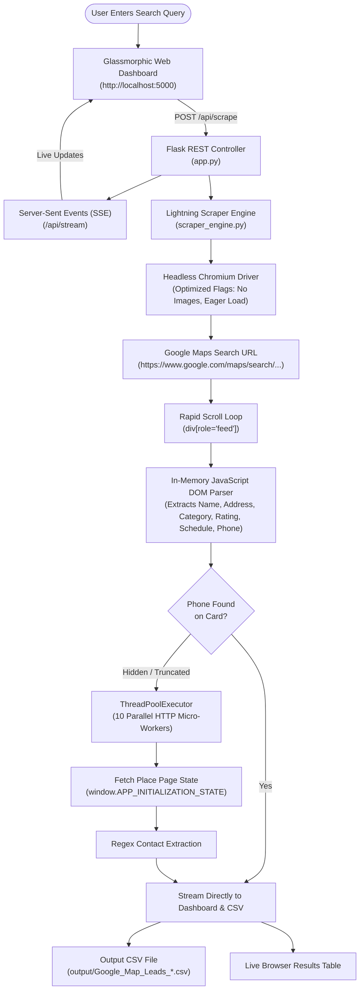

<div align="center">

# ⚡ WebScrapper — Fast Map Leads
### Ultra-Fast, 1-Click Google Maps Lead Generation Engine & Dashboard

**Created & Developed by [Sreeram](https://github.com/sreeram0242-bot)**

[](https://github.com/sreeram0242-bot)
[](https://github.com/sreeram0242-bot/WebScrapper)
[](https://python.org)
[](https://docker.com)
[](https://coolify.io)
[](https://github.com/sreeram0242-bot/WebScrapper)

<br/>

<p align="center">
  <a href="#-about-the-project">About The Project</a> &bull;
  <a href="#-creator">Creator</a> &bull;
  <a href="#-current-technologies-used">Technologies Used</a> &bull;
  <a href="#-how-it-works-architecture">How It Works</a> &bull;
  <a href="#-key-features">Key Features</a> &bull;
  <a href="#-quick-start">Quick Start</a> &bull;
  <a href="#-cloud-deployment-coolify--docker">Coolify / Docker</a> &bull;
  <a href="#-project-structure">Project Structure</a>
</p>

---

</div>

## 📌 About The Project

**WebScrapper (Fast Map Leads)** was designed and engineered by **Sreeram** to solve the fundamental problems plaguing traditional web scraping tools: **extreme slowness, memory hogging, complicated terminal setups, and confusing user interfaces**.

Most traditional Google Maps scrapers open a separate browser tab for every single business listing, taking 10 to 15 minutes to extract 100 leads while freezing your CPU and RAM.

**Sreeram's WebScrapper re-engineers this entirely:**
- ⚡ **Lightning Fast (~10 Seconds for 100 Leads)**: Gathers listings directly from the Google Maps search feed in-memory using optimized JavaScript, with zero slow individual tab navigations.
- 🤫 **100% Invisible Desktop Launchers**: Double-click to launch with zero black console/CMD windows popping up. Runs quietly in the background.
- 🎯 **Designed for Everyone**: A clean, modern glassmorphic web dashboard that anyone—even a non-technical user—can use with just 1 click.
- 📞 **Smart Micro-Enrichment**: A 10-thread parallel background worker pool instantly enriches missing contact numbers without delaying the live feed.
- 📥 **Instant Export**: Download ready-to-use Excel/CSV files formatted with UTF-8 BOM, or copy all phone numbers to clipboard with a single click.

---

## 👤 Creator

This project was built from scratch and is maintained by:

<div align="center">

### **Sreeram**
**Software Developer & Creator of WebScrapper**

[](https://github.com/sreeram0242-bot)
[](https://github.com/sreeram0242-bot/WebScrapper)

*"Engineered to make B2B lead generation instantaneous, lightweight, and accessible to everyone without technical barriers."*

</div>

---

## 🛠️ Current Technologies Used

The application is built using a modern, multi-tiered technology stack optimized for low memory usage, maximum execution speed, and cross-platform compatibility.

| Layer | Technology | Purpose & Implementation |
|---|---|---|
| **Backend Framework** | **Python 3.11+ & Flask** | Lightweight REST API server handling query processing, scraper orchestration, file downloads, and real-time Server-Sent Events (SSE). |
| **Real-time Streaming** | **Server-Sent Events (SSE)** | Unidirectional event stream (`text/event-stream`) delivering live scraper status logs and new lead rows directly to the browser with zero polling delay. |
| **Concurrency Pool** | **`concurrent.futures.ThreadPoolExecutor`** | 10-worker parallel HTTP background thread pool for sub-150ms micro-enrichment of business phone numbers. |
| **Data Processing** | **Pandas** | High-speed data manipulation, duplicate removal, text cleaning, and automated export to Excel-friendly CSV with UTF-8 BOM encoding. |
| **Browser Automation** | **Selenium 4 & Chromium** | High-performance headless browser automation with `eager` page loading, disabled WebGL, disabled CSS images, and blocked remote fonts to minimize RAM footprint. |
| **DOM Parsing** | **Native JavaScript In-Memory Queries** | Evaluates `document.querySelectorAll` directly inside the Chromium engine, parsing search feed cards in 0.01 seconds without slow HTML transfer. |
| **State Inspection** | **Python `urllib` & Custom Regex** | Lightweight, zero-overhead HTTP parser extracting hidden phone numbers directly from Google's embedded `window.APP_INITIALIZATION_STATE` JSON. |
| **Frontend UI** | **HTML5 & Vanilla CSS3** | Custom Glassmorphic design system using Google Fonts (Inter), CSS backdrop filters, responsive grid layout, and high-contrast status badges. |
| **Frontend Logic** | **Vanilla JavaScript (ES6+)** | `EventSource` listener for live data streaming, clipboard integration, 1-click suggestion chip autofill, and dynamic table rendering. |
| **Silent Desktop Launcher** | **Windows Script Host (VBScript)** | `webscarpper.vbs` executes using `wscript.exe` with `SW_HIDE` mode `0` (100% invisible execution with zero console flash), auto-detects Python, self-heals virtual environments, and opens the default browser. |
| **Containerization** | **Docker & Docker Compose** | Multi-architecture Debian Bookworm container supporting both **x86_64 (AMD64)** and **ARM64** (Oracle Cloud Ampere A1), equipped with Chromium and Chromedriver. |
| **Cloud Deployment** | **Coolify & Traefik** | Seamless self-hosted cloud deployment with automatic port mapping (port 5000), persistent volume mounts for exported CSVs, and SSL termination. |

---

## ⚙️ How It Works (Architecture)

### Architectural Flowchart



---

### Step-by-Step Execution Pipeline

#### 1. Search Request & Stream Binding
When the user clicks **🚀 START SEARCH**, the browser issues an asynchronous request to `/api/scrape` with the query and limits. Simultaneously, an `EventSource` connection is established with `/api/stream` to receive real-time updates.

#### 2. Headless Chromium Initialization
The engine launches Chromium in headless mode with performance-tuned flags:
- `--blink-settings=imagesEnabled=false` & `--disable-remote-fonts`: Eliminates image/font download latency.
- `--disable-gpu` & `--no-sandbox`: Reduces memory overhead to ~150 MB.
- `page_load_strategy = "eager"`: Proceeds as soon as the DOM is interactive without waiting for background map tiles or analytics scripts.

#### 3. Rapid Feed Scroll & In-Memory DOM Parsing
The browser navigates to the Google Maps search feed. Instead of loading every business individually:
- As the feed container (`div[role="feed"]`) scrolls downward, native JavaScript runs directly in Chromium's V8 engine.
- Card elements (`div.Nv2PK`) are parsed in memory in **under 10 milliseconds**, extracting:
  - **Business Name**
  - **Category / Industry**
  - **Star Rating & Review Count**
  - **Street Address**
  - **Opening Hours / Schedule**
  - **Website URL**
  - **Direct Phone Number** (when shown on card)

#### 4. Parallel Micro-Enrichment (10 Worker Threads)
If a business listing has its phone number hidden behind a click action on the card, the engine does **not** halt the browser to click and wait:
- The place URL is delegated to a concurrent `ThreadPoolExecutor` with 10 background worker threads.
- Each thread issues a lightweight HTTP request (`~150ms`) and parses Google's raw embedded initialization data (`window.APP_INITIALIZATION_STATE`) using regular expressions.
- This extracts the verified phone number instantly without any UI latency.

#### 5. Real-Time Streaming & UTF-8 BOM CSV Export
- As each lead is enriched, it is immediately pushed across the SSE stream to the user's screen.
- Upon completion, the dataset is processed through Pandas, deduplicated, and saved into the `output/` directory as an Excel-compatible CSV file with UTF-8 BOM encoding (preventing character corruption in Microsoft Excel).

---

## 🌟 Key Features

| Feature | Legacy Scrapers | Sreeram's WebScrapper |
|---|---|---|
| **Extraction Speed** | 8 to 15 minutes per 100 leads | **~10 to 15 seconds per 100 leads** |
| **Page Load Strategy** | Opens 100 separate browser tabs | **Single search feed with in-memory JavaScript** |
| **RAM Footprint** | 1.5 GB – 3.0 GB (causes PC lag) | **~150 MB – 250 MB (ultra-lightweight)** |
| **Desktop Launch** | Flashes black terminal/CMD windows | **100% Invisible (`wscript.exe` SW_HIDE)** |
| **User Interface** | Complex CLI or cluttered dashboards | **1-Click Glassmorphic Web Dashboard** |
| **Phone Number Filter** | Exports empty rows without phones | **Optional 1-Click "Only Leads with Phone" filter** |
| **Export Formats** | Raw CSV (breaks non-English text) | **Excel-compatible UTF-8 BOM CSV + 1-Click Clipboard** |
| **Cloud Deployment** | Difficult to containerize | **Multi-Arch Docker (AMD64 & ARM64) for Coolify** |

---

## 🚀 Quick Start

### Method 1: 1-Click Invisible Launch (Windows — Recommended)
*No command prompt, no terminal windows, no technical knowledge needed.*

1. Clone or download this project folder to your PC.
2. Double-click **`webscarpper`** (or `webscarpper.vbs`).
3. The scraper will start silently in the background and automatically open in your default browser:
   ```text
   http://127.0.0.1:5000
   ```
4. Enter what you want to search (e.g., `Gyms in Mumbai`), choose your lead count, and click **🚀 START SEARCH**!

> **To Stop the Scraper:** Simply double-click **`stop_app.vbs`** (or `stop_app.bat`). It will silently terminate background processes.

---

### Method 2: Manual Developer Setup (Windows, macOS, Linux)

```bash
# 1. Clone the repository
git clone https://github.com/sreeram0242-bot/WebScrapper.git
cd WebScrapper

# 2. Create and activate a virtual environment
python -m venv venv

# Windows:
venv\Scripts\activate
# macOS / Linux:
source venv/bin/activate

# 3. Install dependencies
pip install -r requirements.txt

# 4. Start the application
python app.py
```

Open your browser and navigate to **`http://localhost:5000`**.

---

## ☁️ Cloud Deployment (Coolify & Docker)

WebScrapper includes a production-ready, multi-architecture **`Dockerfile`** and **`docker-compose.yml`** designed for **Coolify** on any VPS or Oracle Cloud Free Tier instance (AMD64 or ARM64 Ampere A1).

### Deploying on Coolify in 4 Steps:
1. Log into your **Coolify Dashboard**.
2. Click **+ Create Resource** &rarr; select **Public/Private Git Repository**.
3. Enter your repository URL: `https://github.com/sreeram0242-bot/WebScrapper.git`.
4. Coolify will automatically detect the `Dockerfile`.
   - Set **Port Exposes** to `5000`.
   - Assign your custom domain or Coolify preview URL (e.g., `https://scraper.yourdomain.com`).
   - Click **Deploy**!

### Resource Consumption in Docker:
- **Disk Space**: ~550 MB (Debian Bookworm base + Chromium + Python dependencies).
- **Idle RAM**: ~70 MB.
- **Active Scraping RAM**: ~200 MB – 260 MB.

---

## 📂 Project Structure

```text
WebScrapper/
├── app.py                   # Flask Web Server, REST API & Server-Sent Events (SSE)
├── scraper_engine.py        # Single Unified Ultra-Fast Scraping Engine
├── templates/
│   └── index.html           # 1-Click Glassmorphic Dashboard (HTML5, CSS3, JS)
├── webscarpper.vbs          # Native Invisible Windows Script Host Launcher (SW_HIDE)
├── webscarpper.bat          # Windows Batch Launcher Wrapper
├── webscarpper              # POSIX Bash Launcher (macOS/Linux nohup daemon)
├── stop_app.vbs             # Silent 1-Click Background Process Stopper
├── stop_app.bat             # Batch Stopper Wrapper
├── Dockerfile               # Multi-arch Chromium & Python Container (AMD64/ARM64)
├── docker-compose.yml       # Production Docker Compose with Persistent Storage Volume
├── .dockerignore            # Docker Build Exclusions Filter
├── requirements.txt         # Lightweight Python Package Dependencies
├── readme.md                # Project Documentation & Architecture Guide
└── output/                  # Default Storage for Generated CSV Lead Lists
```

---

## 📄 License & Attribution

Distributed under the **MIT License**. See `LICENSE` for details.

Developed with precision and passion by **[Sreeram](https://github.com/sreeram0242-bot)**.  
For questions, contributions, or feature suggestions, feel free to open an issue or pull request on [GitHub](https://github.com/sreeram0242-bot/WebScrapper).
